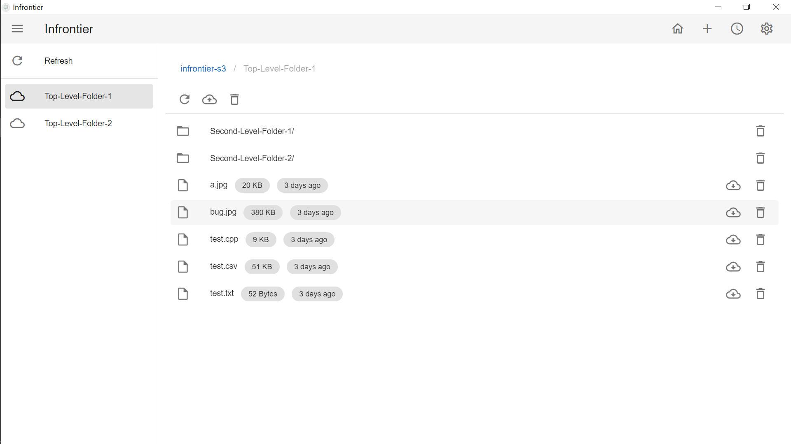

# Infrontier

> Powered by [electron-nuxt](https://github.com/michalzaq12/electron-nuxt).

A simple AWS S3 client written with Electron. Designed for personal use.



## Features

- File content preview.
  - CSV.
  - JPEG/PNG.
  - Other text format.
- **Resumable** multipart upload/download.
  - Even if you close this application by accident, you can resume multipart upload/download next time.
- View pending tasks & cancel task.
  - You can only cancel tasks that are not running.
  - You can stop tasks by close this application.
- Drag file to upload.

## Build Setup

```bash
# install dependencies
yarn install

# serve app with hot reload
yarn dev

# build electron application for production
yarn build
```

## [CHANGELOG](https://github.com/DiscreteTom/Infrontier/blob/main/CHANGELOG.md)
